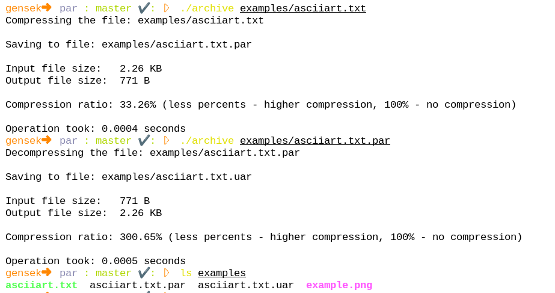

par - data compression program

# Installation

Clone the repository
```
git clone https://github.com/sekvanto/par
cd par
```
Compile
```
javac -d bin/ src/com/shpp/p2p/archiver/*
```
Run
```
./archive [arguments]
```

# Example



# Usage

## Synopsis

```
./archive [options] [input file] [output file]
```

## Options

Optional flags:

`-a` Explicit flag to forcefully archive first file into second file

`-u` Explicit flag to unarchive


If zero filenames are specified, program archives the default file ("test.txt").

If only one filename is specified, the output file name is generated automatically, e.g. Input = "file.txt" => Output = "file.txt.par". If input name has ".par" extension, file will be decompressed and gain extension ".uar", e.g. Input = "file.txt.par" => Output = "file.txt.uar".

If two filenames are specified, first file is compressed/decompressed into second file. Function will depend either on flags, or on input filename.

# FAQ

## Why is the program called par?

par - P2P unarchiver. It was created during SHPP P2P java computer science course (programming.org.ua), that's the reason. The course is named P2P (peer-to-peer), because there are no mentors, students review works of each other and even exams. By the way, if you are a student of this course, please don't read the source code until you write your own archiver. It's againts the rules.

## How efficient is this archiver?

par v1.0 compresses 30 MB per second. The extent of compression depends on file - it's very efficient for files, which are long but have very few unique characters, but in the opposite case the efficiency will be worse.

# TODO

☑  Add Huffman coding support\
▢  Add adaptive Huffman coding (efficient for images), LZW\
▢  Modify program structure, in particular reduce the usage of static methods/fields\
▢  Reduce size of archive heading\
▢  Add support for multithreading

# Architecture/technical details

Currently, the program is based on module-like architecture (mostly built on static methods). The main supported compression algorithm is Huffman coding, however a couple of other more efficient algorithms will be added in the future. Each compressed file has a heading of the following structure:

| Size in bytes | Name | Field description |
| --- | --- | --- |
| 1 | ignoreBits | The number of zeros, which were added during compression to the end of file to make the number of bits divisible by 8. These bits are ignored during decompression |
| 1 | signature | 0x3a by default
| 1 | treeShapeSize | The size of Huffman tree shape after flattening (in bytes)
| 1 | treeLeavesSize | The size of tree leaves value after flattening (in bytes)
| X | treeShape
| Y | treeLeaves
| Z | Archived data

## Tree flattening

The generated Huffman tree flattening can be shown on these two examples:

```
     *                          *
   /   \                      /   \
  E     *                    A     *
       / \                        /  \
      W   K                      *    N
                                / \
                               D   B

  10100                       1011000
  EWK                         ADBN
```

, where first line - tree shape, second line - tree leaves array.

### Tree shape

The linked list of tree shape is formed by pre-order tree traversal. If we reach a parent node, 1 is written, then the structure of its left child and the right one. If we reach a leaf, 0 is written.

### Tree leaves

The array of tree leaves is formed by in-order tree traversal, from left to right.
